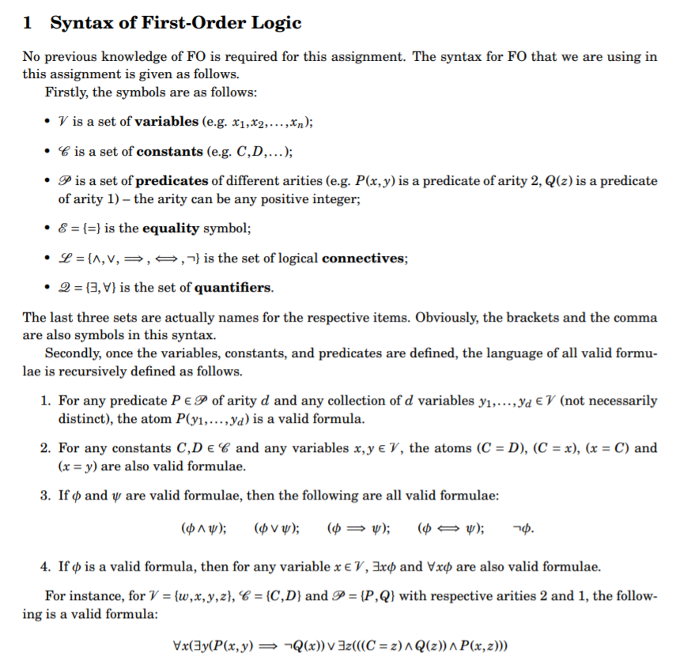

# first-order-logic-parser
Submitted as part of the degree of Msci Natural Sciences (2nd year) to the Board of Examiners in the Department of Computer Sciences, Durham University. 
This summative assignment was assessed and marked by the professor of the module in question:
## Grade: 1st - 97/100
A full parser for first order logic, producing a parse tree (png) and a grammar containing all production rules and symbols, along with a log file.
Repository contains source code, documentation, and example files of the outputs produced by the source code.
## Toy Demo:


# Documentation:
## Prerequisites:
Before running source code, install the following:
-	Python module anytree, via running command `pip install anytree` on command prompt if on windows.
-	Graphviz from http://www.graphviz.org/download/ . Making sure to then add the ``/bin`` folder to your system PATH.

To run python source code (designed for python 3.7.7) run it from the command line with the input text file as its only argument: e.g. `python CD.py input.txt`.

## Produced files:
* Once run, the source code will produce a log file, `log.txt`, containing either a message saying success, telling you both your input file and supplied formula were valid, or, if not, an error message telling you what was wrong.

* The code will also produce a grammar and store it inside a file called `grammar.txt`, containing the set of terminals (\*Vt\*), the set of non-terminals (\*Vt\*) and a set of all the production rules (\*P\*) in the grammar.

* If both the input file and the formula were valid, the program will also produce a visual depiction of the corresponding parse tree, contained in `tree.png`.

* If the input file format was valid, but the formula was not, the appropriate grammar will still be displayed within `grammar.txt`, in order to assist you in troubleshooting your formula. 

## Input:




Your input file must be in a strict format (as per the specification), if this is wrong, the log will tell you what the issue is.

As an example of what a file should look like observe the following (also contained in example.txt):
```
variables: w x y z
constants: C D
predicates: P[2] Q[1]
equality: =
connectives: \land \lor \implies \iff \neg
quantifiers: \exists \forall
formula: \forall x ( \exists y ( P(x,y) \implies \neg Q(x) )  
\lor \exists z ( ( (C = z) \land Q(z) ) \land P(x,z) ) )
```

### Notes: 
* There must be exactly one space between the colon and the first symbol of each category, and one space between each subsequent symbol, finishing the line with a newline (\n) and no space before it, if not an error for extra whitespace will be outputted.

* Furthermore, even if you do not want to define any constants or variables, you must still provide an empty section as such: `constants:\n` (with \n being a newline character)

* However, the formula may contain extra whitespace including tabs and line breaks between formula symbols.

* All indexing of symbol numbers in log file error messages are 0 indexed.

